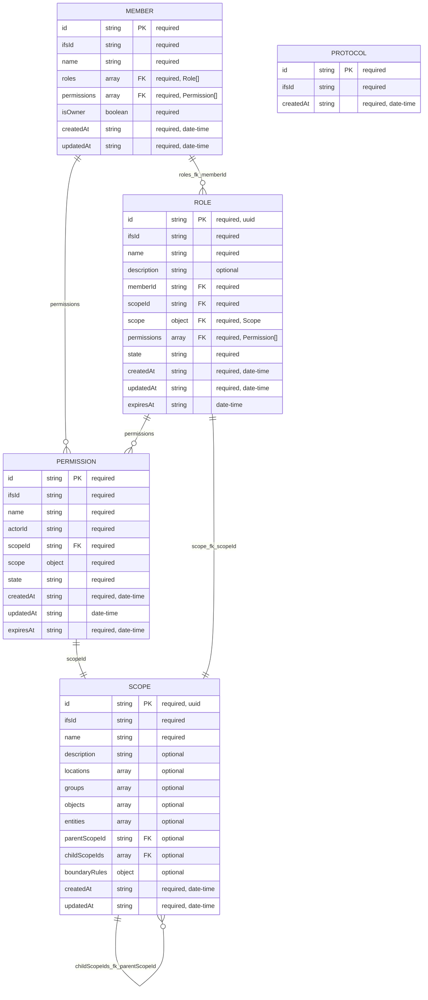

# Entities Overview

<!-- GENERATED BY scripts/generate-entities-overview.mjs. DO NOT EDIT BY HAND. -->

Generated from `src/entities/**/*.schema.json`.

## Relation fields

- `Member.permissions` → `Permission` ($ref, many)
- `Member.roles` → `Role` ($ref, many)
- `Role.memberId` → `Member` (id, one)
- `Permission.scopeId` → `Scope` (id, one)
- `Role.permissions` → `Permission` ($ref, many)
- `Role.scope` → `Scope` ($ref, one)
- `Role.scopeId` → `Scope` (id, one)
- `Scope.parentScopeId` → `Scope` (id, one)
- `Scope.childScopeIds` → `Scope` (id, many)
