# Entities Overview

<!-- GENERATED BY scripts/generate-entities-overview.mjs. DO NOT EDIT BY HAND. -->

Generated from `src/entities/**/*.schema.json`.

```mermaid
erDiagram
  CHANGE {
    id string PK "required"
    ifsId string "required"
    entityType string "required"
    title string "required"
    description string "required"
    changes array FK "required, ChangeItem[]"
    decision object FK "Decision"
    comments array FK "Comment[]"
    commentsUrl string "uri"
    reviewComments array FK "ReviewComment[]"
    authors array FK "required, Member[]"
    mainAuthorId string FK "required"
    mainAuthor object FK "required, Member"
    reviewers array FK "Member[]"
    status string "required"
    diffUrl string "uri"
    number int "required"
    labels array "optional"
    merged boolean "required"
    hasConflict boolean "required"
    links array "optional"
    createdAt string "required, date-time"
    updatedAt string "required, date-time"
    mergedAt string "date-time"
    closedAt string "date-time"
  }
  CHANGEITEM {
    id string PK "required"
    ifsId string "required"
    entityType string "required"
    resourceType string "required"
    operation string "required"
    targetRef string_or_null "required, ifs-ref"
    baseRef string_or_null "required, ifs-ref"
    proposedRef string_or_null "required, ifs-ref"
    description string "optional"
    createdAt string "required, date-time"
    updatedAt string "required, date-time"
  }
  COMMENT {
    id string PK "required"
    ifsId string "required"
    entityType string "required"
    createdAt string "required, date-time"
    updatedAt string "required, date-time"
  }
  DECISION {
    id string PK "required"
    ifsId string "required"
    entityType string "required"
    subject string "required, ifs-ref"
    state string "required"
    previousRevisionId string FK "optional"
    previousRevision object FK "Decision"
    eligibleMembers array FK "required, Member[]"
    affectedMembers array FK "required, Member[]"
    votes array FK "required, Vote[]"
    rules array FK "Rule[]"
    eligibleMemberCount int "required"
    affectedMemberCount int "required"
    voteCount int "required"
    delegateVoteCount int "optional"
    openedAt string "required, date-time"
    closedAt string "date-time"
    cancelledAt string "date-time"
    verifiedAt string "date-time"
    approvedAt string "date-time"
    rejectedAt string "date-time"
    createdAt string "required, date-time"
    updatedAt string "required, date-time"
    decidedAt string "date-time"
  }
  LABEL {
    id string PK "required"
    ifsId string "required"
    entityType string "required"
    createdAt string "required, date-time"
    updatedAt string "required, date-time"
  }
  MEMBER {
    id string PK "required"
    ifsId string "required"
    entityType string "required"
    name string "required"
    roles array FK "required, Role[]"
    permissions array FK "required, Permission[]"
    isOwner boolean "required"
    createdAt string "required, date-time"
    updatedAt string "required, date-time"
  }
  PERMISSION {
    id string PK "required"
    ifsId string "required"
    entityType string "required"
    name string "required"
    actorId string "required"
    scopeId string FK "required"
    scope object "required"
    state string "required"
    createdAt string "required, date-time"
    updatedAt string "date-time"
    expiresAt string "required, date-time"
  }
  PROTOCOL {
    id string PK "required"
    ifsId string "required"
    entityType string "required"
    createdAt string "required, date-time"
  }
  REVIEWCOMMENT {
    id string PK "required"
    ifsId string "required"
    entityType string "required"
    createdAt string "required, date-time"
    updatedAt string "required, date-time"
  }
  ROLE {
    id string PK "required, uuid"
    ifsId string "required"
    entityType string "required"
    name string "required"
    description string "optional"
    memberId string FK "required"
    scopeId string FK "required"
    scope object FK "required, Scope"
    permissions array FK "required, Permission[]"
    state string "required"
    createdAt string "required, date-time"
    updatedAt string "required, date-time"
    expiresAt string "date-time"
  }
  RULE {
    id string PK "required"
    ifsId string "required"
    entityType string "required"
    createdAt string "required, date-time"
    updatedAt string "required, date-time"
  }
  SCOPE {
    id string PK "required, uuid"
    ifsId string "required"
    entityType string "required"
    name string "required"
    description string "optional"
    locations array "optional"
    groups array "optional"
    objects array "optional"
    entities array "optional"
    parentScopeId string FK "optional"
    childScopeIds array FK "optional"
    boundaryRules object "optional"
    createdAt string "required, date-time"
    updatedAt string "required, date-time"
  }
  VOTE {
    id string PK "required"
    ifsId string "required"
    entityType string "required"
    createdAt string "required, date-time"
    updatedAt string "required, date-time"
  }
  CHANGE ||--o{ CHANGEITEM : changes
  CHANGE ||--o{ COMMENT : comments
  CHANGE ||--|| DECISION : decision
  CHANGE ||--o{ MEMBER : authors_fk_mainAuthorId_also_mainAuthor_and_reviewers
  CHANGE ||--o{ REVIEWCOMMENT : reviewComments
  DECISION ||--|| DECISION : previousRevision_fk_previousRevisionId
  DECISION ||--o{ MEMBER : eligibleMembers_also_affectedMembers
  DECISION ||--o{ RULE : rules
  DECISION ||--o{ VOTE : votes
  MEMBER ||--o{ PERMISSION : permissions
  MEMBER ||--o{ ROLE : roles_fk_memberId
  PERMISSION ||--|| SCOPE : scopeId
  ROLE ||--o{ PERMISSION : permissions
  ROLE ||--|| SCOPE : scope_fk_scopeId
  SCOPE ||--o{ SCOPE : childScopeIds_fk_parentScopeId
```

## Relation fields

- `Change.changes` → `ChangeItem` ($ref, many)
- `Change.comments` → `Comment` ($ref, many)
- `Change.decision` → `Decision` ($ref, one)
- `Change.authors` → `Member` ($ref, many)
- `Change.mainAuthor` → `Member` ($ref, one)
- `Change.reviewers` → `Member` ($ref, many)
- `Change.mainAuthorId` → `Member` (id, one)
- `Change.reviewComments` → `ReviewComment` ($ref, many)
- `Decision.previousRevision` → `Decision` ($ref, one)
- `Decision.previousRevisionId` → `Decision` (id, one)
- `Decision.eligibleMembers` → `Member` ($ref, many)
- `Decision.affectedMembers` → `Member` ($ref, many)
- `Decision.rules` → `Rule` ($ref, many)
- `Decision.votes` → `Vote` ($ref, many)
- `Member.permissions` → `Permission` ($ref, many)
- `Member.roles` → `Role` ($ref, many)
- `Role.memberId` → `Member` (id, one)
- `Permission.scopeId` → `Scope` (id, one)
- `Role.permissions` → `Permission` ($ref, many)
- `Role.scope` → `Scope` ($ref, one)
- `Role.scopeId` → `Scope` (id, one)
- `Scope.parentScopeId` → `Scope` (id, one)
- `Scope.childScopeIds` → `Scope` (id, many)
